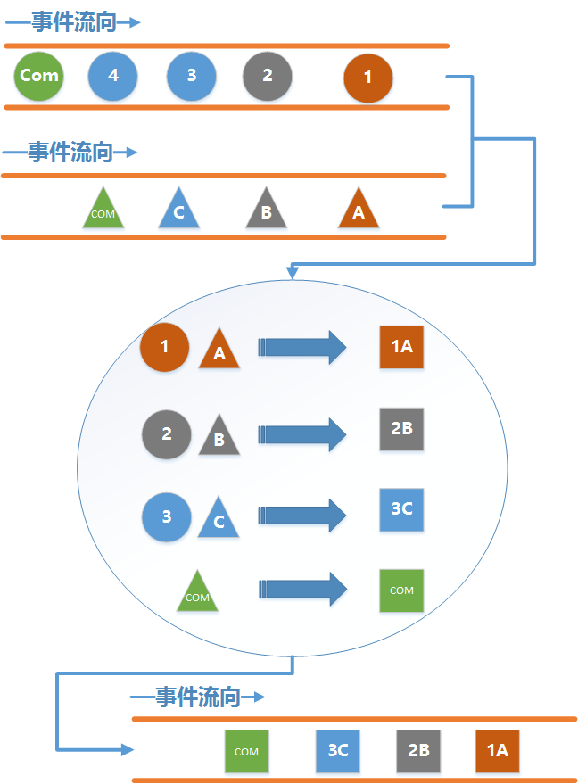
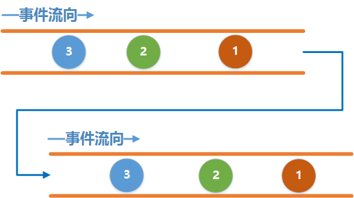
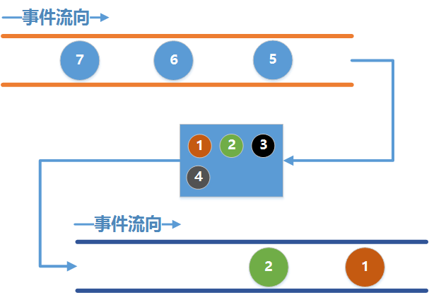

# RxJava2 Learning Notes  

## 原理  
  - 一系列的事件序列，通过上下游链接，使得上游没产生一个事件，下游就能接收到该事件。  
  - 上游和下游就分别对应着`RxJava`中的`Observable`和`Observer`;两者之间的连接就对应着`subscribe()` 
  - 只有当上游和下游建立连接后（调用`subscribe()`），上游才会开始发送事件  

### Demo  

		//创建一个上游Observable.
        Observable<Integer> observable = Observable.create(new ObservableOnSubscribe<Integer>() {
            @Override
            public void subscribe(@NonNull ObservableEmitter<Integer> emitter) throws Exception {
                emitter.onNext(0);
                emitter.onNext(1);
                emitter.onNext(2);
                emitter.onNext(3);
                emitter.onComplete();
            }
        });
        //创建一个下游Observer.
        Observer<Integer> observer = new Observer<Integer>() {
            @Override
            public void onSubscribe(@NonNull Disposable d) {

            }

            @Override
            public void onNext(@NonNull Integer integer) {
                Log.d("sample", "onNext: " + integer);
            }

            @Override
            public void onError(@NonNull Throwable e) {

            }

            @Override
            public void onComplete() {
                Log.d("sample", "onComplete()结束");
            }
        };
        //建立连接
        observable.subscribe(observer);
    }  

### ObservableEmitter  

  - 用于发出事件，它可以发出三种类型的事件，通过调用`emitter的onNext(T value)`,`onComplete()`和`onError(Throwable error)`就可以分别发出next事件，complete事件和errors事件
  - `onComplete()`和`onError(Throwable error)`发送后，上游可以继续发送之后的事件,而下游将不再继续接收事件  
  - `onComplete()`和`onError(Throwable error)`必须唯一且互斥，二者只能发送其一。这点需要自行在代码中控制，代码逻辑中未被这一规则并不一定会导致程序崩溃。发送多个`onComplete()`可以正常运行，下游接收第一个`onComplete()`后不再接收事件。若是发送多个`onError(Throwable error)`，事件会导致崩溃。  

### Disposable  

  - 当调用它的`dispose()`方法时，他将会将两根管道切断，从而导致下游不再继续发送事件。但并不会导致上游不再继续发送事件，上游会继续发送剩余事件。
  - 场景：在网络请求过程中Activity已经退出，这个时候如果回到主线程更新UI，APP会崩溃，所以需要将`Disposable`保存起来，当Activity退
出时，切断它即可。  

### CompositeDisposable  

  - 如果Activity要被销毁时，后台任务还没有执行完，那么会导致Activity不能正常回收。
  - `RxJava`内置的一个容器，`CompositeDisposable`,每当得到一个`Disposal`时就调用`CompositeDisposable.add()`将它添加到容器中，在退出的时候调用`CompositeDisposable.clear()`即可避免内存泄漏。  

### subscribe()  

  - subscribe()有多个重载方法  
    `public final Disposable subscribe() {}`  
    `public final Disposable subscribe(Consumer<? super T> onNext) {} ` 
    `public final Disposable subscribe(Consumer<? super T> onNext, Consumer<? super Throwable> onError) {}`   
    `public final Disposable subscribe(Consumer<? super T> onNext, Consumer<? super Throwable> onError, Action onComplete) {}`  
    `public final Disposable subscribe(Consumer<? super T> onNext, Consumer<? super Throwable> onError, Action onComplete, Consumer<? super Disposable> onSubscribe) {}`   
    `public final void subscribe(Observer<? super T> observer) {}` 
  - 不带任何参数的subscribe()表示下游不关心任何事件。
  - 带有一个`Consumer`参数的方法表示只关心`onNext`事件。

### RxJava中的内置线程选项  

  - `Schedulers.io()`代表io操作的线程，通常用于网络，读取文件等io密集型操作。
  - `Schedulers.computation()`代表CPU计算密集型操作，例如大量计算操作。
  - `Schedulers.newThread`代表一个常规的新线程。
  - `ImmediateThinScheduler.INSTANCE`在当前线程中执行任务。
  - `Schedulers.trampoline()`当其他排队的任务完成后，在当前线程排队开始执行。
  - `Scheduler.single()`上游任务公用一个后台线程。
  - `AndroidSchedulers.mainThread()`代表Android主线程。（rxandroid:2.0.1）
  - `AndroidSchedulers.from(Looper looper)`运行在该Looper对应的线程中。（rxandroid:2.0.1）  
  - 在RxJava内部使用的是线程池来维护这些线程的，所以效率也比较高

### 线程切换  

  - `subdcribeOn()`　指定上游发送事件的线程，只有在第一次指定时有效
  - `observeOn()`　指定下游接收事件的线程  
  
### 操作符`map`  

  - 作用：对上游发送的每一个事件应用一个函数，使得每一个事件都按照指定的函数去变化。通过`map`可以将上游发来的事件转换为任意的类型，可以是Object,也可以是集合。
  - 例子：上游发送的是`Interger`类型，而在下游我们接收到的是`String`类型，中间起转换作用的就是`map`操作符。    
  
### 操作符`flatMap`  

  - 作用：将上游发送的事件的`Observable`变换为多个`Observables`,然后将他们发射的事件合并后放入一个单独的`Observable`里。
  - 上游每发送一个事件，`flatMap`都将创建新的水管，然后发送转换之后的新事件，下游接收到的就是这些新水管发送的数据。
  - 注意：flatMap并不能保证事件的顺序。`concatMap`可以。

### 操作符`concatMap`
  - `concatMap`与`flatMap`作用几乎一样，`concatMap`的结果可以严格按照上游的发送顺序发送。

### 操作符`zip`
- `zip`通过一个函数将多个`Observable`发送的事件结合在一起，然后发送这些组合到一起的事件，且有严格顺序，只发射数据项最少的`Observable`一样多的数据。        
    

### `Backpressure`   
当上下游在**不同**的工作线程中时，上游发送的事件并不是直接到下游中的，而是需要先到一个容器中，上游把事件发送到容器中，下游再从容器中取出事件，当上游发送事件的速度太快，下游取出事件的速度太慢，会导致容器溢出。
- 同步：   
   
- 异步：   
  

- 从数据量上进行治理，减少发送进水缸里的事件
	1. `filter`对事件进行过滤
	2. `sample`对事件进行间隔采样
- 从速度上进行治理，减缓事件发送进水缸的速度 

### `Flowable`  
- 创建Flowable的时候相对Observable增加了一个参数，此参数用于选择背压，也就是上下游流速不均时的处理方法；  
- 下游的onSubscribe不再是传Disposable了，而是传Subscription，可调用Subscription.cancel()切断水管，增加了一个`void request(long n)`的方法； 
- Flowable在设计时采用响应是拉取的方式来更好的解决上下游流速不均衡的问题，rquest当成下游处理事件的能力；  
- 但是只有当**上游正确实现了**如何**根据下游的处理能力**来发送事件的时候，才能达到这种效果；  
- Flowable里默认有一个大小为128的水缸，当上下游工作在不同线程中时，上游会先把事件发到水缸中，当下游调用request时，才从水缸里取出事件。
### `BackpressureStrategy`
- `BackpressureStrategy.BUFFER`,内存增长比Observable慢，但是还是有可能OOM。
- `BackpressureStrategy.DROP`,存满128个时间后丢弃其他事件，下游消费以后才继续装进新事件。
- `BackpressureStrategy.LATEST`,与DROP类似，但是总是能获取到最后最新的事件。

# Tips
- `ofType`根据传递的 eventType 类型返回特定类型(eventType)的 被观察者 

  
